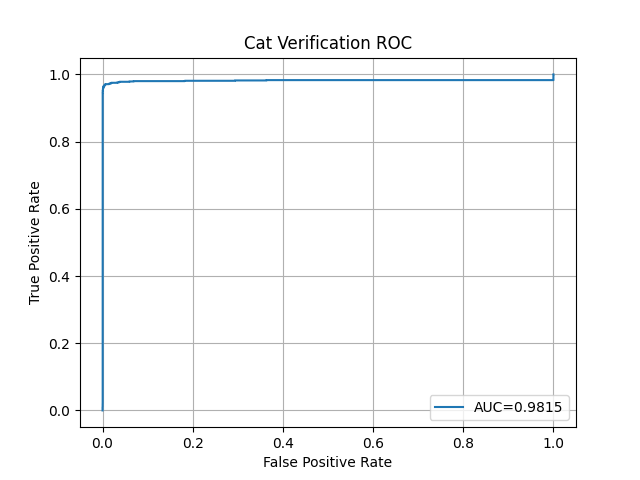
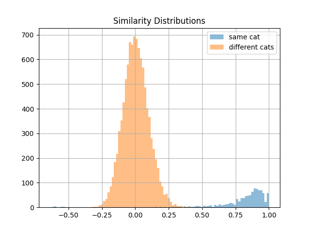

# cat_picture_service

An experimental machine learning pipeline for distinguishing individual cats using facial features.

This project combines landmark detection, face normalization, and metric learning to produce embeddings for cat identification. While the system performs well on the test set (ROC AUC ≈ **0.9815**), it currently struggles to reliably differentiate highly similar cats (e.g., cats from the same litter).

---

##  Features

* Heatmap-based cat facial landmark detection
* Face alignment and normalization
* ArcFace-based embedding generation
* Cosine similarity comparison between cats
* A FastAPI service exposing the full pipeline
* CUDA and Apple MPS support (auto-detected)
* Example requests via `.http` file

---


## Project Structure

- `ml_training/` — training code for the models  
- `FastAPIProject/` — inference API  
- `models/` — stored model weights (Git LFS)  
- `plots/` — evaluation figures  

Both subprojects contain their own `requirements.txt`.

---

## Pipeline Overview

The system consists of two ResNet-18–based models:

### 1. Landmark Model

**Architecture:** ResNet18 + Transpose Convolution
**Purpose:** Heatmap-based facial landmark prediction
**Input:** `.jpg` images
**Output:** 9 landmarks

Landmarks:

* 3 per ear
* Eyes
* Nose

This model:

* Detects cat faces via heatmaps
* Enables affine normalization
* Crops and aligns faces for the embedding model

**Training dataset:**

* [https://www.kaggle.com/datasets/crawford/cat-dataset](https://www.kaggle.com/datasets/crawford/cat-dataset)
* Weiwei Zhang, Jian Sun, and Xiaoou Tang, *Cat Head Detection - How to Effectively Exploit Shape and Texture Features*, ECCV 2008
* Original source: [https://archive.org/details/CAT_DATASET](https://archive.org/details/CAT_DATASET)

---

### 2. Embedding Model

**Architecture:** ResNet18 + ArcFace
**Embedding size:** 256
**Similarity metric:** Cosine similarity

This model generates identity embeddings used to differentiate between cats.

**Training dataset:**

* [https://www.kaggle.com/datasets/timost1234/cat-individuals/data](https://www.kaggle.com/datasets/timost1234/cat-individuals/data)
* Images collected by Tzu-Yuan Lin

---

## Evaluation

Test set performance:

* **ROC AUC:** 0.9815
* **Similarity threshold:** 2.7

### ROC curve



### Similarity Distribution



**Known limitation:** The system is not yet reliable for very similar cats (e.g., same litter).

---

## Running the API

### Requirements

* Python **3.12**
* CUDA **or** Apple MPS (auto-detected if available)

---

### Install dependencies

Install separately for each subproject:

```bash
cd ml_training
pip install -r requirements.txt

cd ../FastAPIProject
pip install -r requirements.txt
```

---

### Start the server

```bash
cd FastAPIProject/app
uvicorn main:app --reload
```
---

## API Endpoints

### `/annotate`

Returns the input image with detected cat faces annotated.

**Input:** image
**Output:** annotated `.jpg`

---

### `/align_face`

Returns a normalized, cropped cat face with eyes and nose aligned to fixed positions.

**Input:** image
**Output:** aligned face images as `.jpg`

---

### `/similarity`

Compares two cat images using cosine similarity of the embedding.

**Input:** two images
**Output:** json containing

* similarity score
* fixed threshold
* boolean indicating same cat

Example requests are provided in the included `.http` file.

---

## Hardware Support

The project automatically detects and uses:

* CUDA GPUs
* Apple Silicon (MPS)
* CPU fallback


---

## Model Weights

Model weights are stored via **Git LFS** in the `models/` directory.

Make sure Git LFS is installed before cloning:

```bash
git lfs install
git clone <repo>
```

---

## Project Status

This is an experimental hobby project with known limitations:

* Works well on the test distribution
* Not robust to very similar cats
* Multi-cat handling not very robust

---

## License

MIT License

